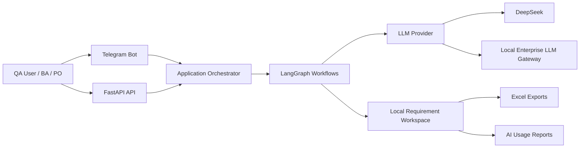
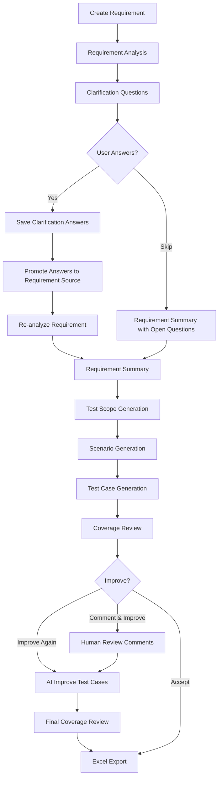
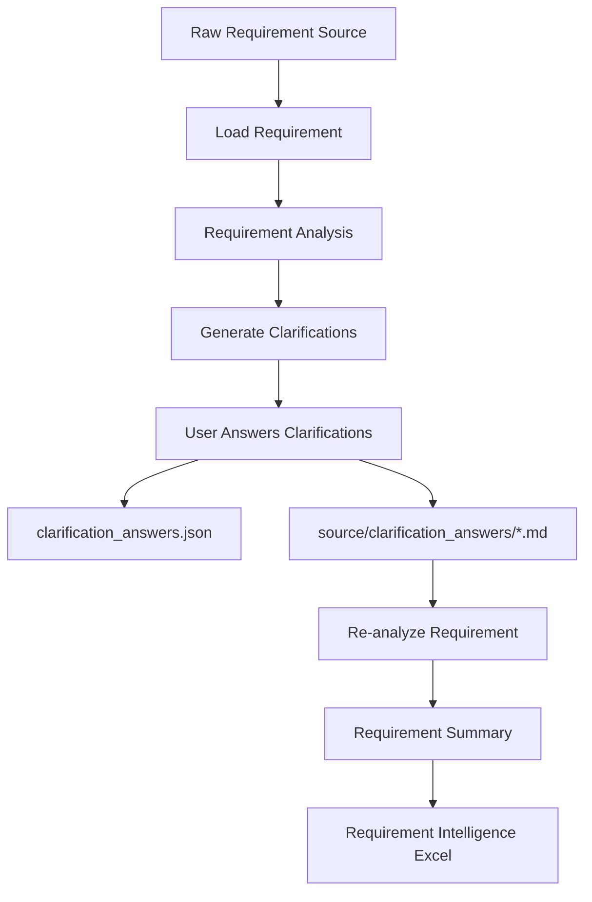
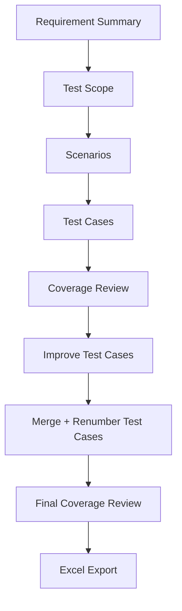
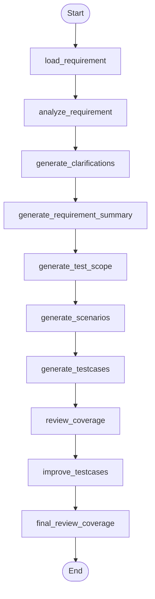
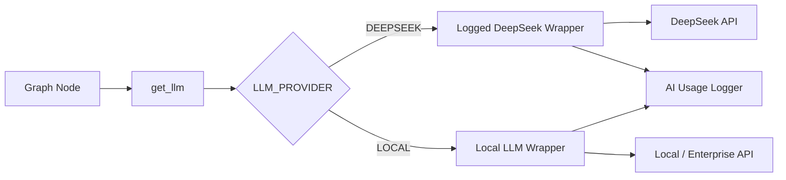
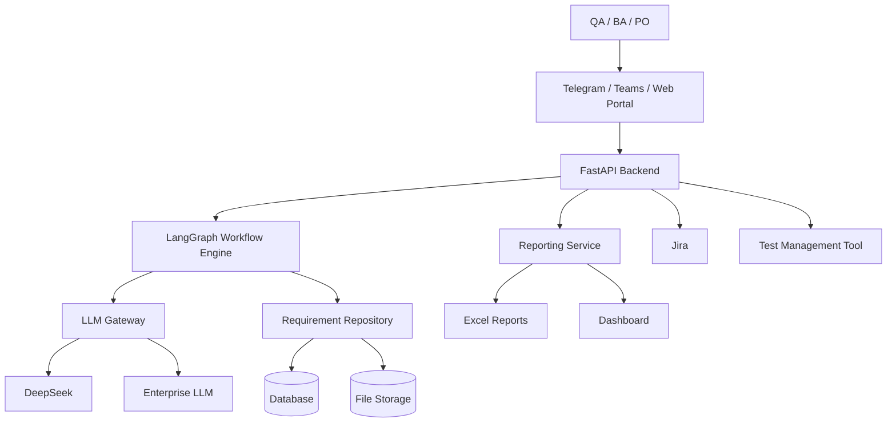

# Architecture Diagram

QA AI Platform architecture overview.

---

# 1. High-Level Architecture



---

# 2. Main Product Flow



---

# 3. Requirement Intelligence Flow



## Notes

Clarification answers are stored in two places:

1. `analysis/clarification_answers.json` for audit and Excel display.
2. `source/clarification_answers/*.md` as enriched requirement source.

This allows the next `/analyze` run to treat answered clarifications as confirmed requirement information.

---

# 4. Test Case Generation Flow



## Current Design Principle

After `requirement_summary.json` is available, downstream nodes should use it as the main source of truth.

This reduces token usage and avoids repeated processing of raw requirement content.

---

# 5. LangGraph Node Architecture



---

# 6. Requirement Workspace Structure

```text
requirements/
└── <ticket_id>/
    ├── ticket.json
    │
    ├── source/
    │   ├── description.md
    │   ├── comments.md
    │   ├── additional_notes/
    │   │   ├── note_001.md
    │   │   └── note_002.md
    │   ├── clarification_answers/
    │   │   ├── clarification_answers_001.md
    │   │   └── clarification_answers_002.md
    │   ├── original_files/
    │   └── extracted/
    │
    ├── analysis/
    │   ├── requirement_analysis.json
    │   ├── requirement_items.json
    │   ├── clarifications.json
    │   ├── clarification_answers.json
    │   ├── requirement_summary.json
    │   └── test_scope.json
    │
    ├── scenarios/
    │   └── scenarios.json
    │
    ├── testcases/
    │   ├── testcases.json
    │   ├── improved_testcases.json
    │   └── improved_testcases_v1.json
    │
    ├── review/
    │   ├── coverage_review.json
    │   ├── final_coverage_review.json
    │   └── review_session.json
    │
    ├── exports/
    │   ├── requirement_intelligence.xlsx
    │   └── testcases_v0.xlsx
    │
    └── logs/
```

---

# 7. Artifact Responsibility

| Artifact | Purpose |
|---|---|
| `ticket.json` | Requirement metadata and display name |
| `source/description.md` | Main requirement text |
| `source/comments.md` | Requirement comments |
| `source/additional_notes/*.md` | Added requirement updates |
| `source/clarification_answers/*.md` | Answered clarifications promoted into requirement source |
| `analysis/requirement_analysis.json` | Structured requirement analysis |
| `analysis/clarifications.json` | Open clarification questions |
| `analysis/clarification_answers.json` | User answers with question mapping |
| `analysis/requirement_summary.json` | Confirmed requirement summary |
| `analysis/test_scope.json` | Test generation scope |
| `scenarios/scenarios.json` | Generated test scenarios |
| `testcases/testcases.json` | Current official test case set |
| `testcases/improved_testcases.json` | Latest improved test cases |
| `review/coverage_review.json` | Initial coverage review |
| `review/final_coverage_review.json` | Final coverage review after improvement |
| `exports/*.xlsx` | Excel deliverables |
| `reports/ai_usage_logs.jsonl` | AI request and token usage logs |

---

# 8. LLM Provider Abstraction



## Supported Providers

```env
LLM_PROVIDER=DEEPSEEK
DEEPSEEK_MODEL=deepseek-v4-flash
DEEPSEEK_API_KEY=xxx
```

```env
LLM_PROVIDER=LOCAL
LOCAL_LLM_URL=http://localhost:3100/v1/chat/completions
LOCAL_LLM_MODEL=claude-sonnet-4.6
```

---

# 9. AI Usage Reporting

```mermaid
flowchart TD
    A[LLM Request] --> B[LoggedLLM / LocalLLM]
    B --> C[ai_usage_logs.jsonl]
    C --> D[/report Command]
    D --> E[System Report Excel]
```

The report includes:

- Requirement count
- Scenario count
- Test case count
- Improve iterations
- AI request count
- Model used
- Input tokens
- Output tokens
- Total tokens
- Duration
- Usage by node

---

# 10. Telegram Command Layer

```mermaid
flowchart TD
    Start[/start/] --> Guide[Command Guide]
    AnalyzeText[/analyze_text/] --> CreateReq[Create Requirement]
    GenerateText[/generate_text/] --> CreateAndGenerate[Create + Generate]
    Analyze[/analyze ticket_id/] --> RequirementIntelligence[Requirement Intelligence]
    Generate[/generate ticket_id/] --> TestGeneration[Test Case Generation]
    AddText[/add_text/] --> AddNote[Add Additional Note]
    AddFile[/add_file/] --> AddFileNode[Add Supporting File]
    Requirements[/requirements/] --> ListReq[List Requirements]
    Status[/status/] --> ReqStatus[Requirement Status]
    Report[/report/] --> AIReport[AI Usage Report]
    Delete[/delete/] --> DeleteReq[Delete Requirement]
```



---

# 11. Current Technical Decisions

## Requirement Summary as Single Source of Truth

Once generated, downstream test design nodes should use:

```text
requirement_summary
+ test_scope
+ requirement_items
```

instead of repeatedly passing full raw analysis and clarifications.

## Clarification Answers as Requirement Source

Answered clarifications are promoted to:

```text
source/clarification_answers/*.md
```

This makes future analysis runs naturally aware of confirmed answers.

## Test Case Merge Strategy

After improvement:

```text
original testcases
+ improved testcases
→ merge
→ renumber
→ save as current testcases.json
```

This ensures later exports and improvements use the latest official test suite.

---

# 12. Planned Architecture Improvements

## Short Term

- Reduce token usage in coverage review nodes
- Make final coverage review delta-based
- Improve traceability enforcement from Requirement → Scenario → Test Case
- Add better error handlers for Telegram bot
- Add validation for missing `.env` values

## Medium Term

- FastAPI endpoint for all Telegram workflows
- Microsoft Teams interface
- Jira sync for requirement updates and clarification questions
- Requirement lifecycle dashboard
- Web UI for requirement review and test case approval

## Long Term

- Enterprise authentication
- Role-based access control
- Central database storage
- Multi-project support
- Full audit trail
- Test management tool integration
- CI/CD integration

---

# 13. Target Architecture



---

# 14. Summary

The QA AI Platform is evolving from a simple test case generator into a Requirement Intelligence and QA Design Platform.

The key architecture principles are:

- Keep requirement source auditable
- Keep clarification answers as part of the requirement history
- Use requirement summary as the main downstream context
- Preserve traceability across all generated artifacts
- Track AI usage and model cost
- Keep humans in control of final approval
