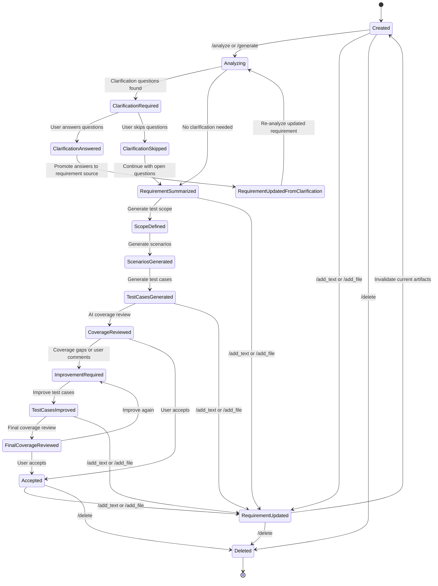
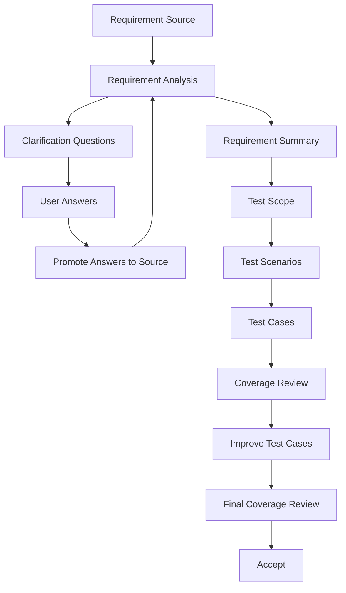

# Requirement Lifecycle State Machine

This document describes the lifecycle states of a requirement in the QA AI Platform, from creation to analysis, clarification, test generation, improvement, reporting, and deletion.

---

# 1. Purpose

The Requirement Lifecycle State Machine defines how a requirement moves through the platform.

It helps the system decide:

- Whether a requirement is newly created
- Whether it needs analysis
- Whether clarification answers are required
- Whether test cases can be generated
- Whether generated test cases are outdated
- Whether a requirement needs re-analysis after updates
- Whether the requirement has accepted test cases

---

# 2. High-Level State Flow



---

# 3. Lifecycle States

## 3.1 Created

A requirement has been created but no AI analysis has been completed yet.

Typical sources:

- `/analyze_text <requirement>`
- `/generate_text <requirement>`
- Uploaded requirement file
- Jira ticket import

Artifacts:

```text
requirements/<ticket_id>/
├── ticket.json
└── source/
    ├── description.md
    ├── comments.md
    ├── additional_notes/
    ├── original_files/
    ├── extracted/
    └── clarification_answers/
```

Status example:

```text
Created
```

---

## 3.2 Analyzing

The AI analyzes the requirement source and extracts structured requirement information.

Input:

- Description
- Comments
- Uploaded documents
- Additional notes
- Promoted clarification answers

Output artifacts:

```text
analysis/requirement_analysis.json
analysis/requirement_items.json
```

Extracted data:

- Actors
- Functional requirements
- Business rules
- Validations
- Dependencies
- Risks
- Missing information
- Requirement items with stable IDs

---

## 3.3 Clarification Required

The system detects unclear, missing, or ambiguous requirement details.

Output artifact:

```text
analysis/clarifications.json
```

Example:

```json
{
  "clarification_questions": [
    {
      "question_id": "Q001",
      "category": "Validation",
      "question": "What is the maximum allowed email length?",
      "impact": "High",
      "reason": "Boundary testing requires a confirmed maximum length."
    }
  ]
}
```

Status example:

```text
Awaiting Clarification Answers
```

---

## 3.4 Clarification Answered

The user provides answers to clarification questions.

Example Telegram answer:

```text
Q001: 255 characters
Q002: Password must contain a number, special character, and alphabet character
```

Output artifact:

```text
analysis/clarification_answers.json
```

Recommended structure:

```json
{
  "raw_answers": "Q001: 255 characters",
  "answers": {
    "Q001": "255 characters"
  },
  "answered_clarifications": [
    {
      "question_id": "Q001",
      "question": "What is the maximum allowed email length?",
      "answer": "255 characters",
      "answered_at": "2026-06-05T15:34:10"
    }
  ]
}
```

---

## 3.5 Requirement Updated From Clarification

Clarification answers are promoted into the requirement source so that future analysis treats them as confirmed requirement information.

Output folder:

```text
source/clarification_answers/
└── clarification_answers_001.md
```

Example content:

```md
# Clarification Answers 1

Created: 2026-06-05 15:34:10

## Q001

Question:
What is the maximum allowed email length?

Answer:
255 characters
```

After promotion, downstream artifacts should be invalidated so that analysis and test generation are based on the updated requirement source.

Artifacts to invalidate:

```text
analysis/requirement_summary.json
analysis/test_scope.json
scenarios/scenarios.json
testcases/testcases.json
testcases/improved_testcases.json
review/coverage_review.json
review/final_coverage_review.json
review/review_session.json
```

Artifacts to keep:

```text
analysis/clarifications.json
analysis/clarification_answers.json
exports/*.xlsx
```

---

## 3.6 Requirement Summarized

The platform consolidates the requirement into a business-readable summary.

Output artifact:

```text
analysis/requirement_summary.json
```

Summary sections:

- Executive summary
- Functional summary
- Confirmed business rules
- Validation rules
- Open questions
- Assumptions
- Risks

This becomes the primary source for downstream test design.

---

## 3.7 Scope Defined

The system defines which testing categories should be included or excluded.

Output artifact:

```text
analysis/test_scope.json
```

Scope categories:

- Positive
- Negative
- Validation
- Boundary
- Business rule
- Security
- Permissions
- UX/UI
- Integration
- Network
- Localization
- Timezone

---

## 3.8 Scenarios Generated

AI generates test scenarios based on the requirement summary and test scope.

Output artifact:

```text
scenarios/scenarios.json
```

Each scenario should include:

```json
{
  "scenario_id": "SC001",
  "title": "Successful account registration",
  "type": "Positive",
  "priority": "High",
  "description": "...",
  "related_requirement_ids": ["FR001", "BR001", "VAL001"],
  "traceability": "FR001, BR001, VAL001"
}
```

---

## 3.9 Test Cases Generated

AI generates one test case for each scenario.

Output artifact:

```text
testcases/testcases.json
```

Each test case should include:

```json
{
  "testcase_id": "TC001",
  "scenario_id": "SC001",
  "title": "Successful account registration",
  "type": "Positive",
  "priority": "High",
  "preconditions": [],
  "test_steps": [],
  "expected_results": [],
  "test_data": {},
  "related_requirement_ids": ["FR001", "BR001", "VAL001"],
  "traceability": "FR001, BR001, VAL001"
}
```

---

## 3.10 Coverage Reviewed

The system reviews whether generated test cases cover the confirmed requirement summary.

Output artifact:

```text
review/coverage_review.json
```

Typical review output:

- Coverage score
- Covered areas
- Missing coverage
- Weak test cases
- Recommendations

---

## 3.11 Improvement Required

This state occurs when:

- AI coverage review finds gaps
- User chooses `Improve Again`
- User submits `Comment & Improve`

Inputs:

- Current test cases
- Coverage gaps
- Review comments

---

## 3.12 Test Cases Improved

AI improves only missing, weak, or impacted test cases.

Output artifacts:

```text
testcases/improved_testcases.json
testcases/improved_testcases_v1.json
testcases/testcases.json
```

The latest official test suite should be stored in:

```text
testcases/testcases.json
```

Improved versions should be retained for history.

---

## 3.13 Final Coverage Reviewed

The system reviews the improved test cases.

Output artifact:

```text
review/final_coverage_review.json
```

This state helps the user decide whether to:

- Improve again
- Comment and improve
- Accept test cases

---

## 3.14 Accepted

The user accepts the current test cases as final.

Output artifact may include:

```text
review/review_session.json
```

Example:

```json
{
  "accepted": true,
  "improve_iterations": 2,
  "max_iterations": 3
}
```

---

## 3.15 Requirement Updated

A requirement can be updated at any time using:

```text
/add_text <ticket_id>
/add_file <ticket_id>
```

When updated, current AI artifacts should be invalidated because existing analysis, scenarios, and test cases may no longer be valid.

Do not delete historical Excel exports unless explicitly requested.

---

## 3.16 Deleted

A requirement is permanently removed using:

```text
/delete <ticket_id>
```

All local artifacts are deleted from:

```text
requirements/<ticket_id>/
```

---

# 4. Artifact-Based Status Resolution

The platform should determine requirement status from artifacts, not only from exported Excel files.

Recommended priority:

```python
if testcases/improved_testcases.json exists:
    status = "Improved Test Cases Generated"
elif testcases/testcases.json exists:
    status = "Test Cases Generated"
elif scenarios/scenarios.json exists:
    status = "Scenarios Generated"
elif analysis/test_scope.json exists:
    status = "Test Scope Ready"
elif analysis/requirement_summary.json exists:
    status = "Requirement Intelligence Completed"
elif analysis/clarifications.json exists and not analysis/clarification_answers.json exists:
    status = "Awaiting Clarification Answers"
elif analysis/clarification_answers.json exists:
    status = "Clarifications Answered"
elif analysis/requirement_analysis.json exists:
    status = "Requirement Analyzed"
else:
    status = "Created"
```

---

# 5. Commands and State Transitions

| Command | From State | To State | Description |
|---|---|---|---|
| `/analyze_text` | None | Created → Analyzing | Create and analyze requirement from text |
| `/analyze` | Created / Updated | Analyzing | Analyze existing requirement |
| `/generate_text` | None | Created → Full generation flow | Create requirement and generate test cases |
| `/generate` | Created / Summarized | Test generation flow | Generate scenarios and test cases |
| `/add_text` | Any active state | Requirement Updated | Add requirement note and invalidate current artifacts |
| `/add_file` | Any active state | Requirement Updated | Add requirement file and invalidate current artifacts |
| `/requirements` | Any | No transition | List requirements and statuses |
| `/status` | Any | No transition | Show detailed requirement status |
| `/report` | Any | No transition | Generate AI usage and requirement report |
| `/delete` | Any | Deleted | Delete one requirement |
| `/delete_all` | Any | Deleted | Delete all requirements after confirmation |

---

# 6. Artifact Invalidation Rules

## 6.1 Requirement Source Updated

Triggered by:

```text
/add_text
/add_file
```

Remove:

```text
analysis/requirement_analysis.json
analysis/clarifications.json
analysis/clarification_answers.json
analysis/clarification_questions_snapshot.json
analysis/requirement_summary.json
analysis/test_scope.json
scenarios/scenarios.json
testcases/testcases.json
testcases/improved_testcases.json
review/coverage_review.json
review/final_coverage_review.json
review/review_session.json
```

Keep:

```text
exports/*.xlsx
reports/*.jsonl
```

---

## 6.2 Clarification Answers Promoted

Triggered by:

```text
User answers clarification questions
```

Remove:

```text
analysis/requirement_summary.json
analysis/test_scope.json
scenarios/scenarios.json
testcases/testcases.json
testcases/improved_testcases.json
review/coverage_review.json
review/final_coverage_review.json
review/review_session.json
```

Keep:

```text
analysis/clarifications.json
analysis/clarification_answers.json
source/clarification_answers/*.md
exports/*.xlsx
```

---

# 7. Recommended Single Source of Truth

The requirement source should be composed from:

```text
source/description.md
source/comments.md
source/additional_notes/*.md
source/extracted/*.md
source/clarification_answers/*.md
```

The downstream test design flow should use:

```text
requirement_summary.json
requirement_items.json
test_scope.json
```

This avoids repeatedly sending raw requirement context to every AI node and reduces token usage.

---

# 8. Recommended Downstream Flow



---

# 9. Quality Rules

## Requirement Analysis

- Do not invent business rules
- Treat promoted clarification answers as confirmed requirement source
- Do not mark answered information as missing

## Clarifications

- Ask only unresolved questions
- Do not ask again about already answered information
- Maximum 5 highest-impact questions

## Test Scope

- Use requirement summary as the main source
- Exclude open questions
- Explain excluded categories

## Scenarios

- Use requirement summary, test scope, and requirement items
- Always populate `related_requirement_ids`
- Always use stable requirement IDs such as `FR001`, `BR001`, `VAL001`

## Test Cases

- Generate one test case per scenario
- Preserve scenario ID
- Preserve related requirement IDs
- Preserve traceability

## Improve Test Cases

- Improve only missing, weak, or impacted test cases
- Do not regenerate the entire suite unless required
- Merge improved test cases back into the official `testcases.json`
- Renumber test case IDs after merge

---

# 10. Future Enhancements

- Explicit state metadata file per requirement
- Web UI state timeline
- Requirement versioning
- Diff between requirement versions
- AI impact analysis after requirement update
- Automatic re-analysis recommendation
- Per-node token cost tracking
- Per-requirement lifecycle dashboard
